  I finished BE(EEE) at AITEC (as it was called earlier), in 1999. We were the first batch at this campus. My seniors got started at a make-shift place. The whole campus w

## How it happened
  Got to know through a recent passout that VLSI dept is seeking external examiner to review for M.Tech(VLSI) projects. Expressed interest and in few days it all got confirmed.

## A trip with family
  Had to convince spouse that this is a one time opportunity :) .. to get to see my college. After some talk and few arguments, convinced her.... kids get 3 days off. Got to miss my routines... few exceptions had to be made (generally I prefer not to travel without purpose..). Just 1 hr before departure from my town, asked amma if she's interested, and she was ... she came with me for the admissions.. so this is a special occassion for her.
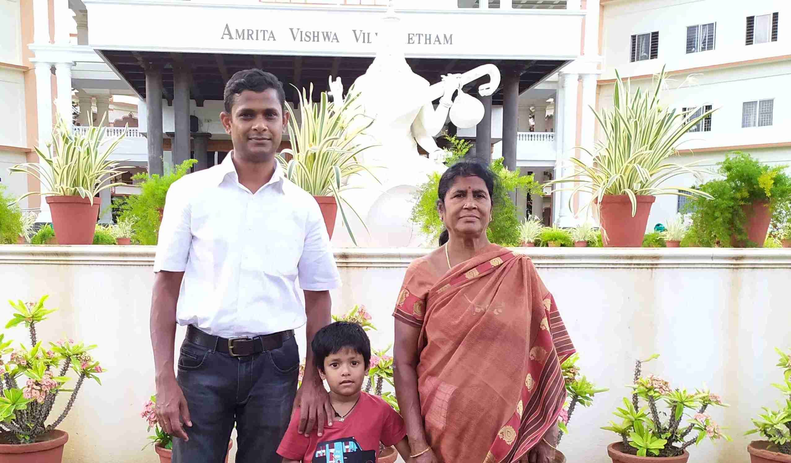

## Reaching there...
  We started 27th from bangalore, and 28th evening 7pm from my town. Throught the journey had recollections of how I joined the college came frequently in my mind. I was against joining this college... There was a great argument as I was very comfortable doing Applied Electronics at CIT, Coimbatore.. Anyway, back to this story, .. reached there about 9pm, and found the Guest House was a great place to stay. Food was kept ready and all of us retired for the night.

## Reviews
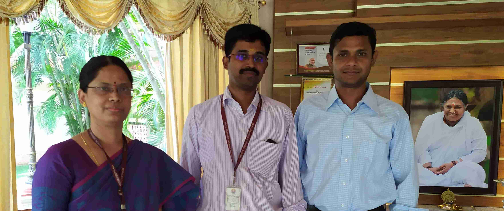

## Meeting next batch VLSI students
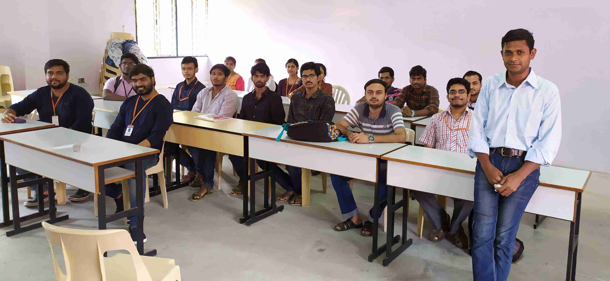

## Meeting Radhamani Madam & Haran Sir
She was the HOD of EEE department and Haran Sir was the HOD of Mech department. Had a very great time talking with them. Looked like they had just came here that morning from Amritapuri. I felt bad surprising them. But just went with the flow .. bought them about 3 KGs of pomogranate and red apples. My kids became very restless and it was time for us to leave. Haran sir was very excited to see my kids as he revealed that he was also an identical twin. He showed his twin brother's pic as well. He also played with my kids (very unusual..), and I missed clicking few pics... :( The moment never comes twice..
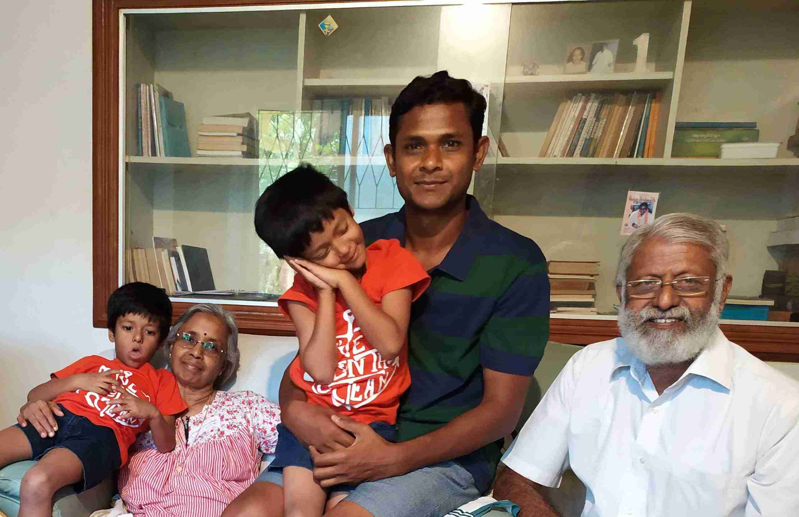

## Warden Srinivasan
Srinivasan was very young, in his late 20's. He had a very distinct tone to his voice. He was very straight forward and truthful (as far as I knew him). He used to note down the list of students wasting food.. Was very happy meeting him too.. Introduced my spouse & mother.. He's now the head of canteen.
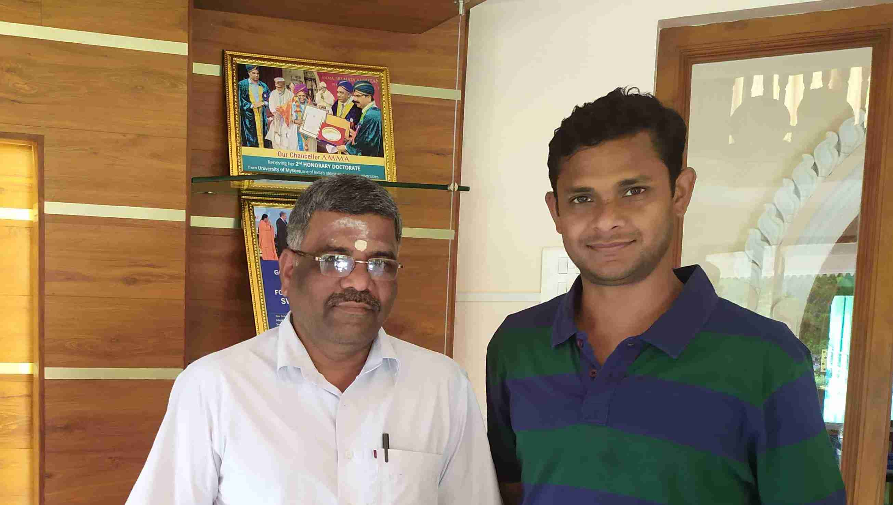

## Where I used to pretend to be a basketball player
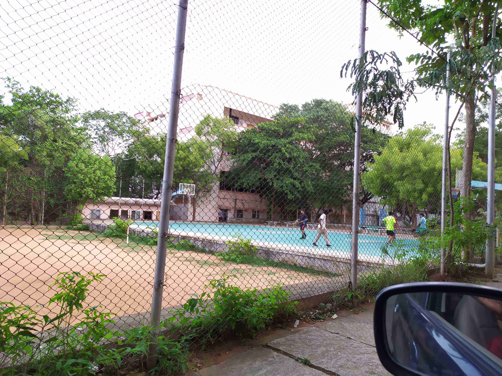

## Where we used to play cricket
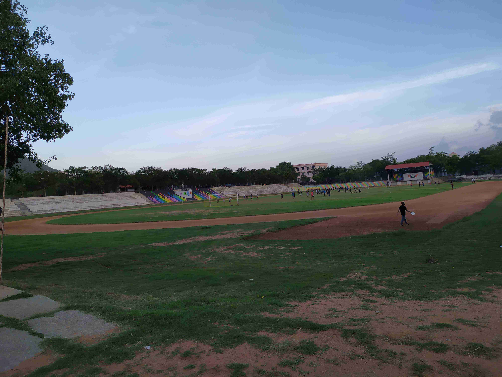
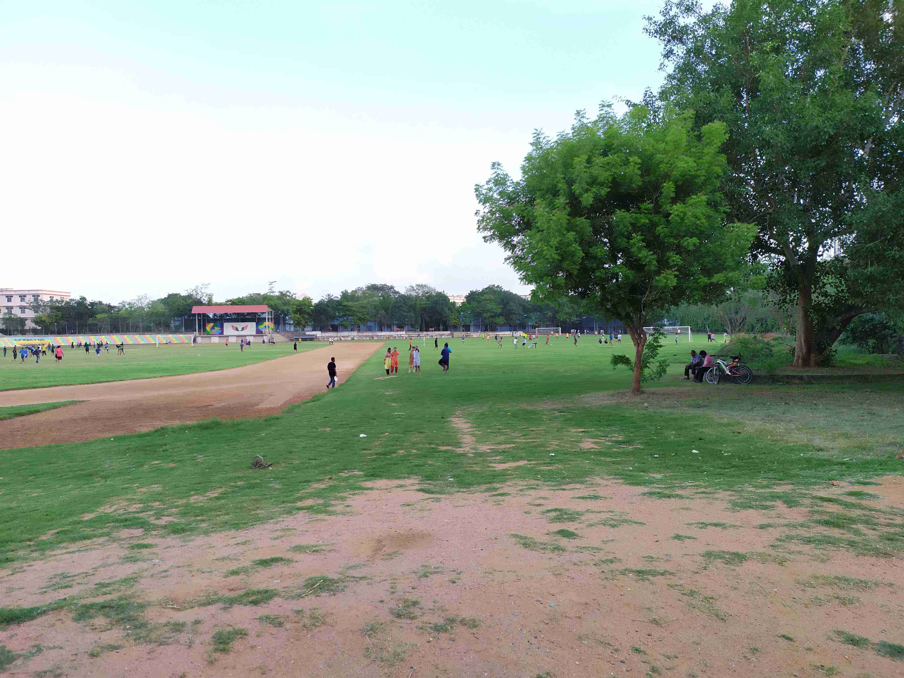

## The one place I could never forget and the one time I would want to go back!
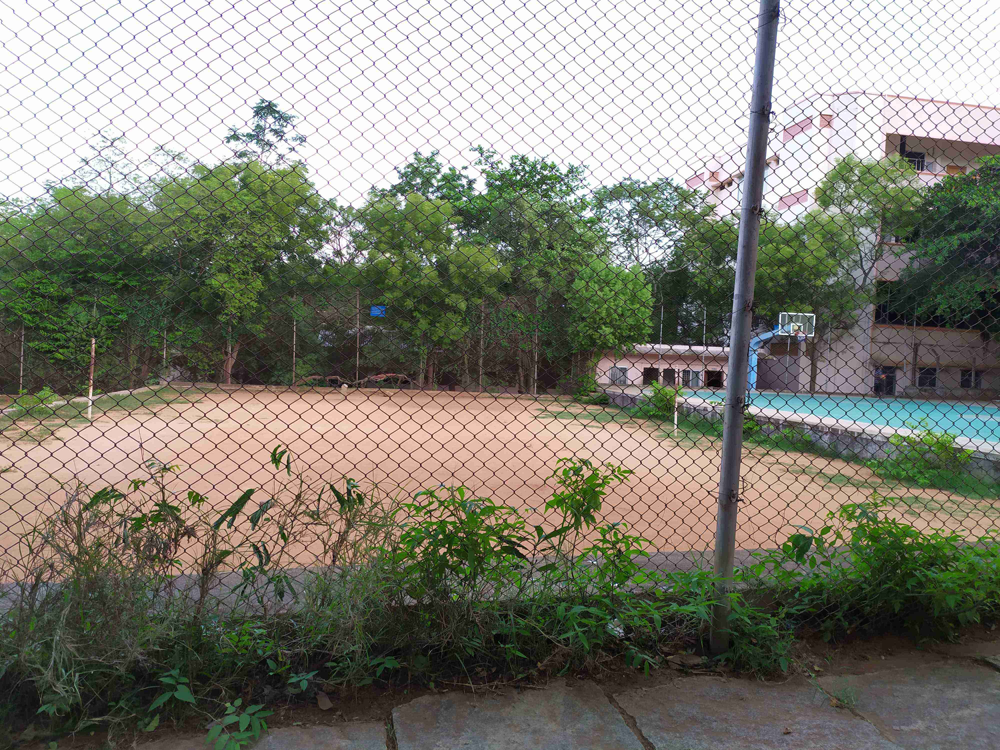
This is truely the one place I could never forget... it was about sports day in 1998. I, single-handedly won the match for my team. Together with a win, we get points for the home-team. Navadeepan was the men's leader for the my home team. The matches were to be played over the weekdays and the earlier weekend I went to my town to bring a bat. My team was strong with Gnanendran, Lokesh and Kumar. Ganendran used to play the center. Over that weekend, supposedly Navadeepan wanted to replace me in the team so that he can be playing in another sport as well. He was the Kabadi captain and was confident to win that.  
Oblivious to these plans, I came back, and on that Tuesday we had the matches. We won against weeker teams. But another team had two better players in the back and they floated the ball very well. In a best of 3 matches, we lost the first one. I did advice to Gnani to come to the net & kill the floaters, but he didn't listen to me. Then we ended up 10 points down in the second game.. it was all looking very grim for us.  
Then in this loosing match, I took my chances, started playing in the center, and started killing all floaters. I did good serves too, and when we were about to win, I did high serves too... we won the match... Upon winning, Navadeep understood the importance of me in the team. They treated like a hero. Navadeep lifted me on his shoulders and they took a walk from this ground to the hostel.. I felt like a hero. 
This is the difference between real players and those who use influences to get to better positions. When the real test comes, these sheeps run away.. This is the second instance in my life, I would want to go back to ... and re-live it again. 

## Meeting OJK
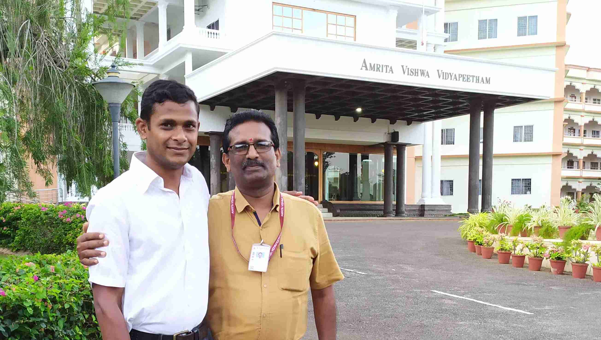

## Men's Hostel
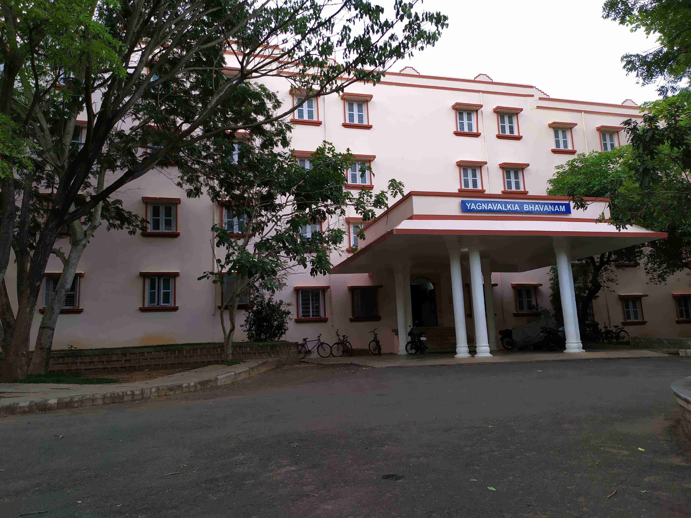

## Playing Tennis on June/29/2019
<iframe width="560" height="315" src="https://www.youtube.com/embed/EnG_E8mXArk" frameborder="0" allow="accelerometer; autoplay; encrypted-media; gyroscope; picture-in-picture" allowfullscreen></iframe>
When we left in 1999, the courts were barely made and 've never seen anyone play there... For some reason, I liked this game ... used to play 2 years when I was about 10 yrs old... It was very exciting to play with almost two generations down under. Enjoyed .. Nowadays, I'm making sure to play Tennis almost everyday... there's one court near my home in Bangalore.

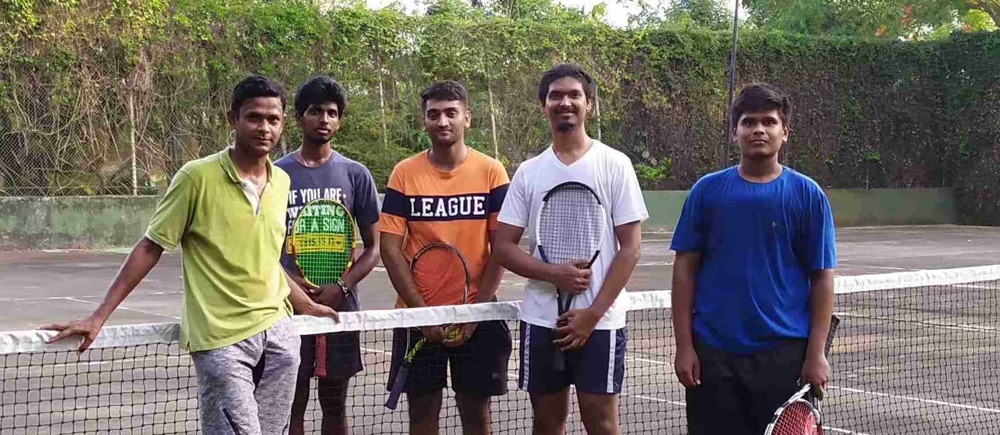
