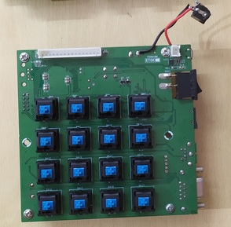
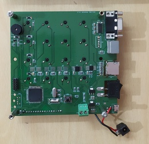

# Design of Billing Machine with ATMEGA128
The single reason I was unhappy with [Atmega32 based design](/works/embedded/at32_biller/) was the inability to fit FatFS in the Flash. So, moved the design to Atmega128 for the single reason to reuse the codebase.

## Boards
  
  

## Comments
<Vssue title="Design of Billing Machine with ATMEGA128" />
