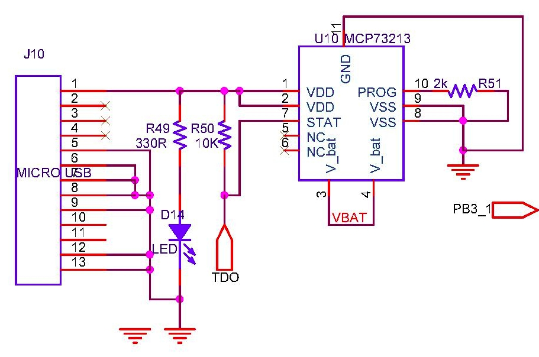

## Battery & Backup
The MCP73213 circuit can be used to directly connect to Lithium-Ion batteries. You can get these in bangalore at Shanti Electronics, SP Road. It is just near the town-hall busstop. I took few months to find this shop, so sharing this info here. They have Panasonic batteries and one from a local manufacturer as well.  
They also sell Lithium-Ion batteries with charging circuitry as well. So, that would be a good choice. In which case, the MCP73213 circuit is not required.

### Circuit
  

### Unit Tests

### Board Tests
::: danger
The existing [test_battery.c](https://github.com/narenkn/atmega_biller/blob/atmega128/tests/test_battery.c) looks to be **incomplete**.
:::

[test_vcc.c](https://github.com/narenkn/atmega_biller/blob/atmega128/tests/test_vcc.c)

