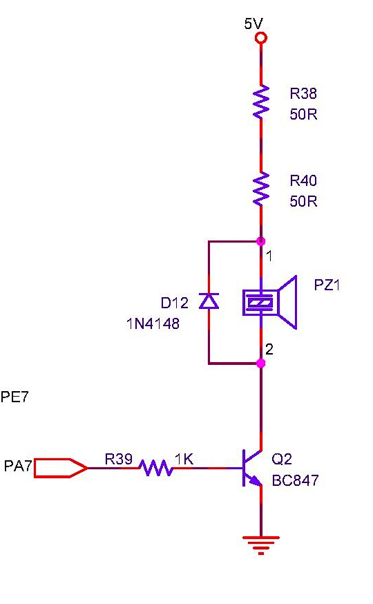

## Buzzer

### Circuit
 <br>

### Drivers
```c
#define BUZZER_ON  PORTA |= 0x80
#define BUZZER_OFF PORTA &= ~0x80
```

### Board Tests
* Files [test_buzzer.c](https://github.com/narenkn/atmega_biller/blob/atmega128/tests/test_buzzer.c)
