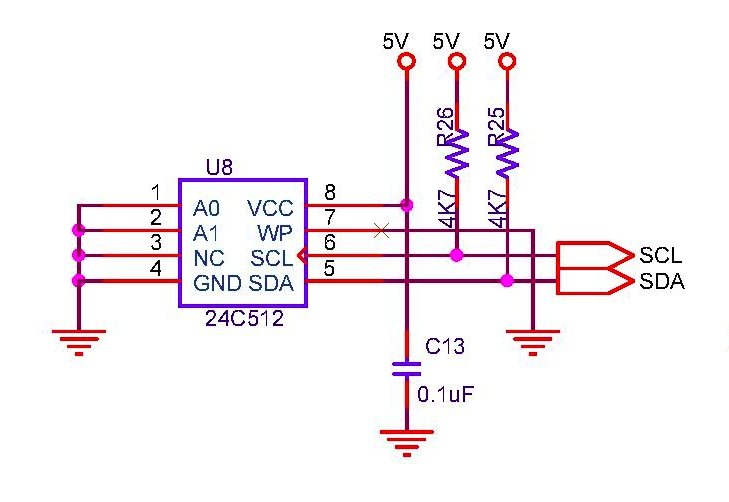

## EEPROM Storage
I2C EEPROMs are very slow devices. The plan is to store items into them. Only one I2C memory can be connected. Storage for Billing, is now completely moved to [Nand Flash](./nandf.md). For the sake of testing, if NAND flash is not present (`#define NVFLASH_EN=0`), then bills are also located in EEPROM. EEPROM exports `ee24xx_read_bytes` & `ee24xx_write_bytes` functions for accesses.  
The source branch [atmega128_no_eeprom](https://github.com/narenkn/atmega_biller/tree/atmega128_no_eeprom) stores both items and billing in flash memory. The plan is to move away from I2C based devices as they are very slow. In this case it is easy to configure the total items & bills in the product via [billing.h](https://github.com/narenkn/atmega_biller/blob/atmega128_no_eeprom/billing.h).  
I2C is also used for RTC with [external DS1307](rtc.md).

### Circuit
  

### Drivers
* Files [i2c.c](https://github.com/narenkn/atmega_biller/blob/atmega128/i2c.c), [i2c.h](https://github.com/narenkn/atmega_biller/blob/atmega128/i2c.h)  

### Unit Tests
* Files [test_i2c.c](https://github.com/narenkn/atmega_biller/blob/atmega128/units/test_i2c.c)  

### Board Tests
* Files [test_eeprom.c](https://github.com/narenkn/atmega_biller/blob/atmega128/tests/test_eeprom.c)  

### In-built EEPROM
AT128 has 4K of internal EEPROM, which can be byte accessed and erased. The library functions `eeprom_update_byte` & `eeprom_read_byte` are used for this purpose. One special routine `eeprom_update_byte_NP` is provided for string copy into internal EEPROM.
