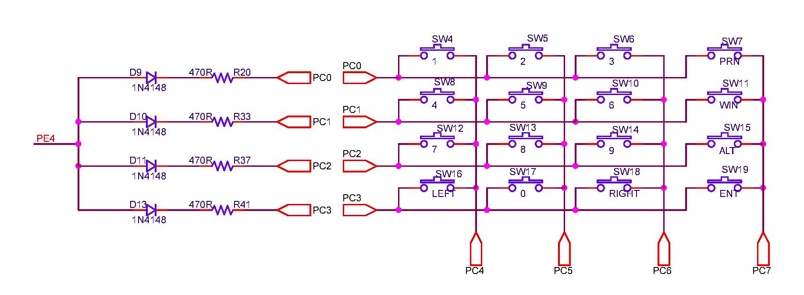

## Keypad

### References
1. [Keypad on Amega32](/works/embedded/at32_biller/keypad.html)
1. [4 x 4 Keypad - Wake-up on Keypress](/resources/embedded/doc1232.pdf)
1. [AVR sleep interrupt with keypad](https://electronics.stackexchange.com/questions/193878/avr-sleep-interrupt-with-keypad)

### Circuit
  

### Unit Tests
Unit tests are written such a way that they provide the expected ASCII input. This information is inversed and sent as scancodes to keyboard routines, which rightly recomputes it back to its ASCII value. Almost all tests use these routines.

### Board Tests
* Files [test_kbd.c](https://github.com/narenkn/atmega_biller/blob/atmega128/tests/test_kbd.c), [test_kbd_1.c](https://github.com/narenkn/atmega_biller/blob/atmega128/tests/test_kbd_1.c)  
* Test [test_menu_1.c](https://github.com/narenkn/atmega_biller/blob/atmega128/tests/test_menu_1.c) was used to test routines such as `menuGetYesNo`, `menuGetChoice` & `menuGetOpt`.
