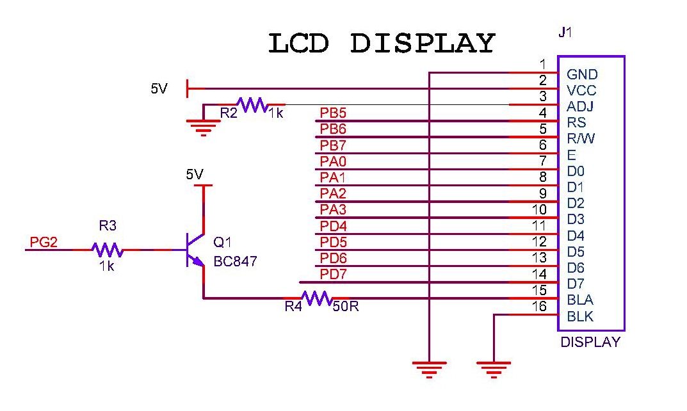

## LCD
_JHD162A_ is very limited in its display. I also evaluated a TFT screen and was very successful to drive it via the SPI port, but the screen was very small 2.4" in diagonal and requires dedicated RAM. So, ditched that idea.  

The alternative is the _JHD2004_, which is socket compatible with _JHD162A_ (very neat!), and that was the selling point. As I had LCD calls throught every part of my code, this was the simplest solution to increasing the display size.  

## Drivers
* Files [lcd.c](https://github.com/narenkn/atmega_biller/blob/atmega128/lcd.c), [lcd.h](https://github.com/narenkn/atmega_biller/blob/atmega128/lcd.h)

## References
1. [Display of ATMEGA32 based design](/works/embedded/at32_biller/display.md).
1. [JHD204a](/resources/embedded/jhd204a.pdf)
1. 

### Circuit
  

### Board Tests
Almost all tests use LCD routines to provide visual information. Listed are the exclusive tests and the ones used for bringup/ debug.

* Files [test_lcd.c](https://github.com/narenkn/atmega_biller/blob/atmega128/tests/test_lcd.c), [test_lcd_nointer.c](https://github.com/narenkn/atmega_biller/blob/atmega128/tests/test_lcd_nointer.c), [test_lcd_nointer_2.c](https://github.com/narenkn/atmega_biller/blob/atmega128/tests/test_lcd_nointer_2.c)  

### SPI based TFT
Some SPI based TFT devices were tested and found to work well. The 2.4-inch screen was too small for the product, hence ditched the idea. Checkout [test_tft_1.c](https://github.com/narenkn/atmega_biller/blob/atmega128/tests/test_tft_1.c), [test_tft_text.c](https://github.com/narenkn/atmega_biller/blob/atmega128/tests/test_tft_text.c)
