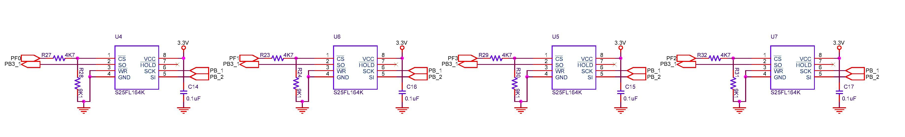

## Internal Flash Storage
The `#define NVFLASH_EN=1` is used to select flash storage over I2C EEPROM storage. Plan was to use Cypress's 64Mbits/8M bytes part & upto 4 such devices connected together. So, the total addr space is 32Mbytes & need 25[24:0] addr bits. But we're using 16-bit pointers. So, each block needs to be of size (25-16)=9 bit wide (512 bytes/ block).

### References
1. SPI Flash storage

### Circuit
  

### Drivers
* Files [flash.c](https://github.com/narenkn/atmega_biller/blob/atmega128/flash.c), [flash.h](https://github.com/narenkn/atmega_biller/blob/atmega128/flash.h)

### Unit Tests
* Files [test_flash.c](https://github.com/narenkn/atmega_biller/blob/atmega128/units/test_flash.c)

### Board Tests
* Files [test_spiflash.c](https://github.com/narenkn/atmega_biller/blob/atmega128/tests/test_spiflash.c), [test_flash.c](https://github.com/narenkn/atmega_biller/blob/atmega128/tests/test_flash.c)
