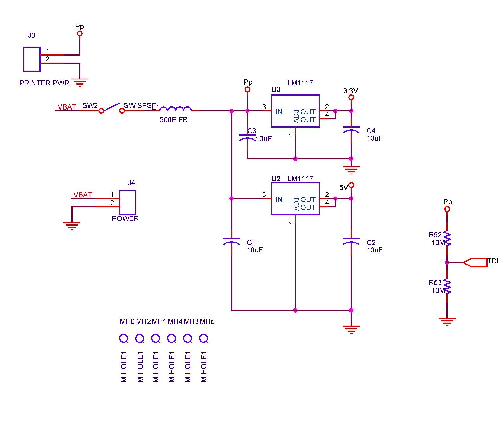

## Power
* Input power adapter to _J4_ would be 9V, which costs about &#x20B9;180. I would advice against use of 12V adapter to this circuit.
* The inductance 600E got burnt during my tests and replaced it with short. I put this in place due to the intermittent current requirement of thermal printer. I didn't get any issue during my testing, so the circuit works will without it. If needed, one should pick atleast 2A rated inductor (cheap through-hole component should work good).
* LM1117-5 LDO (TO220) & LM1117-3.3 LDO (SOT) were the choices.
* TDI/ADC7 port can be used to check the battery voltage (voltage divided). These resistors have about 95% accuracy, so I would suggest a through-hole & use of few parallel resistors to help do the job. Need to be mindful of the leakage current here. I do not like circuits that have leakage current. Another idea would be to directly read the AT128's output after voltage division.

### Circuit
  
