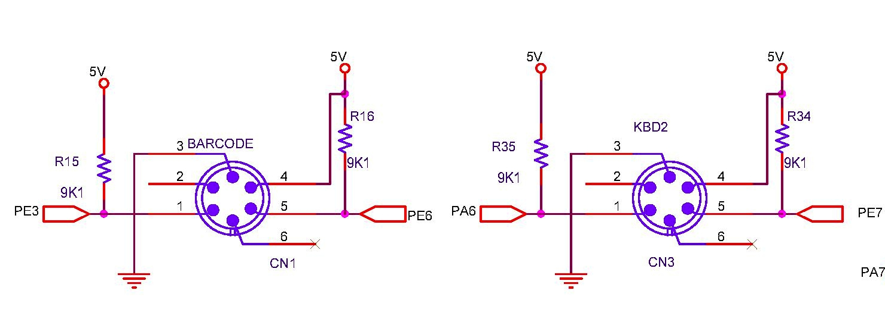

## Keyboard & Barcode
Two independent PS/2 connectors are provided to be able to connect either a keyboard and a barcode scanner. One can buy a barcode scanner with PS/2 interface (rather than the regular USB interface). Input can also be taken via [keypad](./keypad.md). Any keypress from these three inputs, gets serialized and is kept in a queue for consumption.

### Circuit
 <br>

### Queue
Upto 8 characters can be serially queued. This feature is required as some devices could take a bit longer to complete its operation. All input devices are interrupt triggered and data is very difficuilt to get missed.
```c
typedef struct s_keyHitData {
  /* to program */
  uint8_t KbdData;
  uint8_t KbdDataAvail;
  /* keypad data in transit */
  uint8_t _kbdData;
  uint8_t _kbdDataAvail;
  uint8_t count;
  /* keypad+keyboard data in transit */
  uint8_t  hbCnt;
  uint64_t hitBuf;
  uint64_t availBuf;
} keyHitData_t;
```
Any key input is encoded into two bytes one containing the ASCII value (stored in `KbdData`) and the control codes (Cntrl, Shift, Alt etc.. stored in `KbdDataAvail`). Generally the control chars are handled by the keyboard routines and not required for program routines to handle them. The variables `hbCnt`, `hitBuf` & `availBuf` are used to store the pending key information.

### Unit Tests
Unit tests are written such a way that they provide the expected ASCII input. This information is inversed and sent as scancodes to keyboard routines, which rightly recomputes it back to its ASCII value. Almost all tests use these routines.

### Board Tests
* Files [test_ps2barscan.c](https://github.com/narenkn/atmega_biller/blob/atmega128/tests/test_ps2barscan.c), [test_ps2kbd_2.c](https://github.com/narenkn/atmega_biller/blob/atmega128/tests/test_ps2kbd_2.c), [test_ps2kbd.c](https://github.com/narenkn/atmega_biller/blob/atmega128/tests/test_ps2kbd.c) <br>
