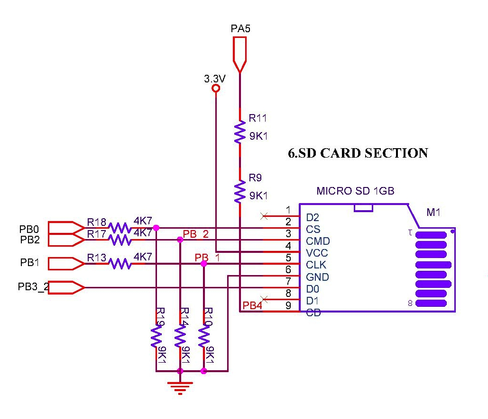
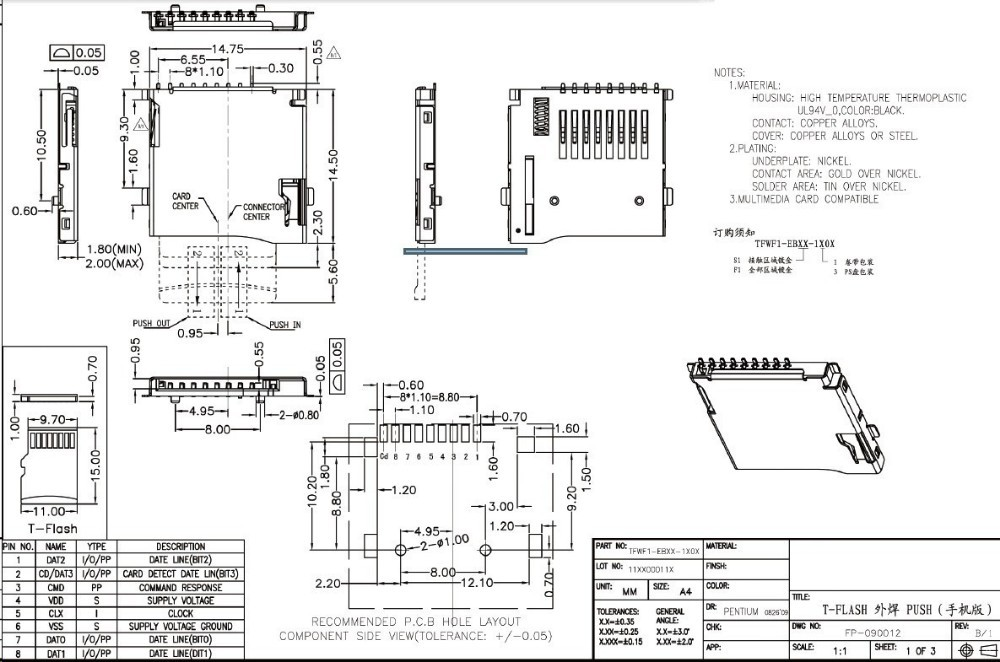
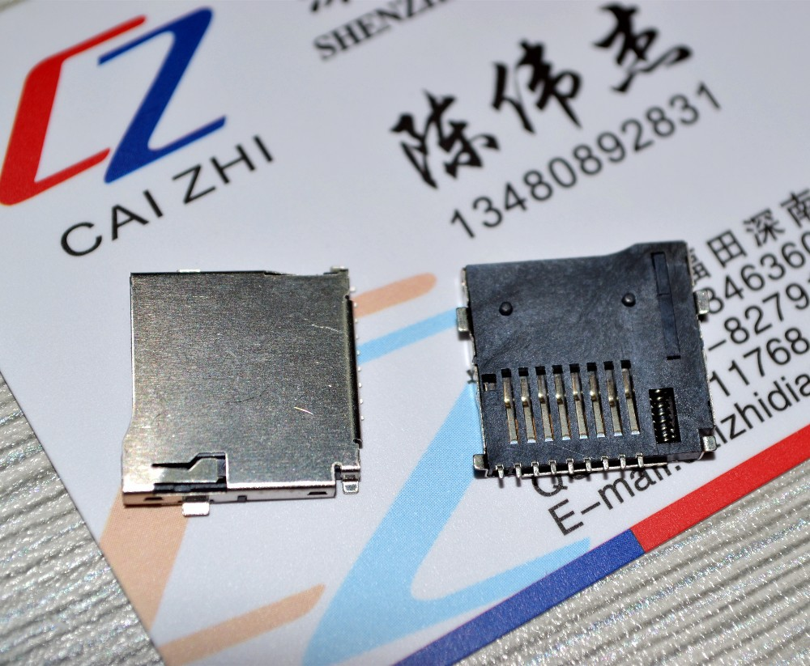

## Micro-SD Card
Micro SD card is one of external interfaces (the other being UART). Given that in recent computers, UART interfaces are not present by default, uSD provides a convinient way to interface. This could be used to retrieve bills, add/update item descriptions & to update firmware.

## References
1. [SD/SDHC Card Interfacing with ATmega8/32](https://www.dharmanitech.com/2009/01/sd-card-interfacing-with-atmega8-fat32.html)
1. [FatFs](http://elm-chan.org/fsw/ff/00index_e.html)

### Circuit
  

### Drivers
* Files [ff.c](https://github.com/narenkn/atmega_biller/blob/atmega128/ff.c), [ff.h](https://github.com/narenkn/atmega_biller/blob/atmega128/ff.h), [ffconf.h](https://github.com/narenkn/atmega_biller/blob/atmega128/ff_conf.h), [mmc_avr.c](https://github.com/narenkn/atmega_biller/blob/atmega128/mmc_avr.c)  

### Unit tests
* Files [test_ff.c](https://github.com/narenkn/atmega_biller/blob/atmega128/units/test_ff.c), [test_ff_unix.c](https://github.com/narenkn/atmega_biller/blob/atmega128/units/test_ff_unix.c), [test_ff_features.c](https://github.com/narenkn/atmega_biller/blob/atmega128/units/test_ff_features.c)  

### Board tests
* Files [test_ff.c](https://github.com/narenkn/atmega_biller/blob/atmega128/tests/test_ff.c), [test_ff_open.c](https://github.com/narenkn/atmega_biller/blob/atmega128/tests/test_ff_open.c)  

### Adapter used
  
  

The 9th pin _CD_ is the card-detect. When a card is inserted, it shorts this pin to GND/Body. This is connected to _PB4_ and has a very high resistors to limit current on _PA5_. If instantaneous notification is necessary, the circuit can be changed to a week pullup with connection to an interrupt pin. In this design, the uSD card is not for the customer to use for normal purposes. Rather it is for backup storage purpose.
