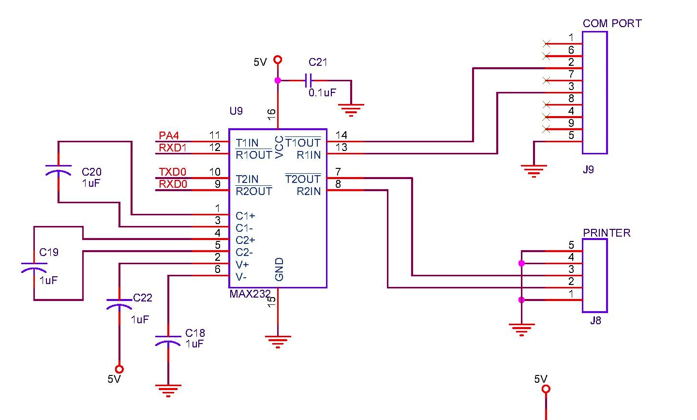

# UART Interface
This interface is used without flow control signals. We would be running the interface at a baud rate of 9600. Some receivers are smart to recover clock from the start bit.

## Printing
The printer has both RS232 interface & direct signal (5V) interface. I've tested both of them.

## UART Interface
Could be used to interface with a [weighing machine](/works/embedded/at32_biller/weighmc.html).

### Circuit
  

### Unit Tests

### Board Tests
* [test_bill.c](https://github.com/narenkn/atmega_biller/blob/atmega128/tests/test_bill.c)
* [test_uart2pc.c](https://github.com/narenkn/atmega_biller/blob/atmega128/tests/test_) : for weighing machine & possible PC connectivity.
* [test_uart.c](https://github.com/narenkn/atmega_biller/blob/atmega128/tests/test_uart.c)
* [test_printer_1.c](https://github.com/narenkn/atmega_biller/blob/atmega128/tests/test_printer_1.c) : Reads keyboard & prints it...
