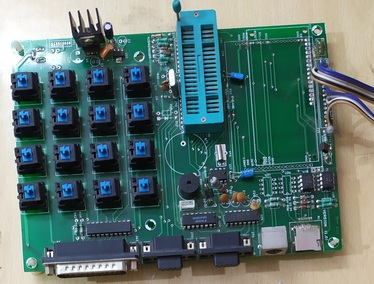
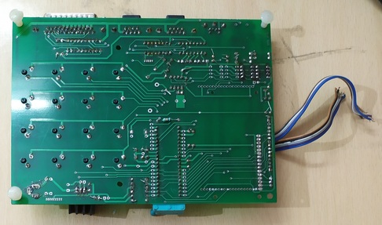

# Design of Simple Billing Machine with ATMEGA32
Embedded system design was one of my passions and I felt the necessity to learn and use the available time doing some project. I started looking around to find a kind of project that would be doable and if possible could bring it to Indian market. I finalized on billing machines as the right project as these were being adopted in multiple shops.

## Boards
  
  

## Overview
The four critical components of the billing system are display, keyboard, storage and printer. The choice of AT32 microprocessor was due to the fact that I determined that I would be able to accomplish these tasks with AT32 system with ease. Moreover AT32 microprocessor was avaialble in electronics market in Bangalore, India.
<dl>
  <dt>Display</dt>
  <dd>Most of the existing billing machines like from (WEP, NGX, TVS), had 2x16 display. The [JHD162A](/resources/embedded/JHD162A.pdf) display neededs a minimum of 6 pins to drive. One more pin may be required if brightness was required to be controlled.</dd>

  <dt>Keyboard</dt>
  <dd>Existing billing machines had varying number of keypads in them : some of them as low as 20 buttons and others like 80-odd. I also noticed some outlets  were directly using a desktop computer. So, I designed with 16 keypads on the device and an option to connect a keyboard. AT32 doesn't have an USB interface, but a PS2 keyboard could be interfaced through 2 bit serial interface. 16 keypads in matrix configuration needed 8 pins and 2 pins for PS2 interface.</dd>

  <dt>Storage</dt>
  <dd>I2C based EEPROMs was the choice of storage and I could get a 1M-bit/128K-bit one for about &#x20B9;130.</dd>

  <dt>Printer</dt>
  <dd>The only printer that was available in the market was the [A1 Micro Panel Thermal Printer](/resources/A1Printer.pdf). It needed only 2 pins for connectivity.</dd>
</dl>

Hence a total of 20 pins was of absolute necessity. AT32 had 32 IO pins, so had confidence on this choice. The secondary components required were power/battery, buzzer, interface to weighing machine, more storage.

Software was a critical component too. I dnd't go with existing libraries and decided to write the complete software from scratch to have tight control over performance. The software should also have good self-tests and that's possible, if only I had control over all pieces of software.

## Source
Source code is available in public [repo](https://github.com/narenkn/atmega_biller/tree/atmega32), without any obligation. Use it at your own risk!!! The relevant branch for this project is _atmega32_.