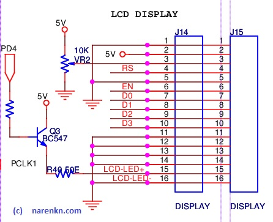

# Display
  There are two models available in the market and with traders in aliexpress. In my opinion, the blue one is more attractive than the yelloish-green one.

## References
1. [JHD162A](/resources/embedded/JHD162A.pdf)

## Circuit

<!---->

Features of this circuit:
1. 4-bit drive is used.
1. Backlight is controlled through PD4, to conserve power.
1. Two connectors J14, J15 are provided, incase a back-facing display is required (to show the customer, during the billing process).
1. If any keypress occurs while LCD's backlight is OFF, the keypress is swallowed and LCD's backlight is turned ON.
