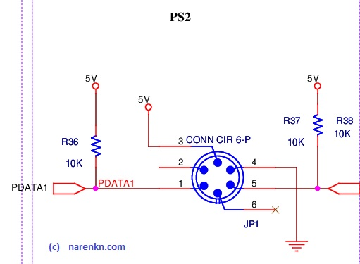

# PS/2 Keyboard
  Keypad is one of the most used components and theres quite a chance that it may wearout due to improper usage or accidental damage. Providing a PS/2 interface requires less circuit components and has lets usage of device even if the keypad is damaged and not working. Moreover we've provided a bit clumsy interface with the keypad, so a keypad provides alternative. It is important to understand the PS/2 protocol to understand the driver implementation.

## References
1. [PS/2 Mouse/Keyboard Protocol](http://www.burtonsys.com/ps2_chapweske.htm)

## Circuit

## Driver
* Source files : [kbd.c](https://github.com/narenkn/atmega_biller/blob/atmega32/kbd.c), [kbd.h](https://github.com/narenkn/atmega_biller/blob/atmega32/kbd.h)  

PS2 is a serial communication with CLK & DATA, with CLK being active low. So, by getting trigged on the negative edge of CLK, we could receive all the 12-bits related to 1-byte oftransaction. About 2-4 bytes of data is sent for each key-press & key-release. On reception of the last bit, the _INT0\_vect_ takes further action to put the key onto _keyHitData_. It does the necessary conversions from the scan codes to ascii with the help of look-up-tables `ps2code2ascii` and `ps2code2asciiE0`.

## Board test
* Source files : [kbd.c](https://github.com/narenkn/atmega_biller/blob/atmega32/kbd.c), [kbd.h](https://github.com/narenkn/atmega_biller/blob/atmega32/kbd.h)
* If any keypress occurs while LCD's backlight is OFF, the keypress is swallowed and LCD's backlight is turned ON.
