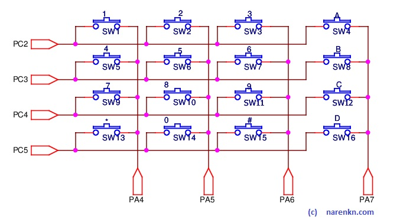

# Keypad

## References
1. [CHERRY MX Keyswitches](https://www.mouser.in/new/Cherry-Electrical/cherry-mx-keyswitch/)
1. [4×3 Matrix Keypad Interface](https://circuitdigest.com/microcontroller-projects/keypad-interfacing-with-avr-atmega32)

## Circuit

Deriving from some work done during college with matrix based topology and some information available in the internet, I went with this matrix circuit. I was soon to realize its shortcoming. Then did some boardlevel hacks to modify the circuit to trigger INT2 vector as soon as any key is pressed. The modified circuit was similar to the one in the [next project](/works/embedded/at128_biller/).

Keypad circuit was one of the major shortcomings of my design.. ofcourse that's why you do a test board before your production one! Some major drawbacks of this circuit were
* No current limiting when key's are pressed
* Can't idle the processor as it has to keep scanning the keypad
* Battery life would reduce

## Driver
* Source files : [kbd.c](https://github.com/narenkn/atmega_biller/blob/atmega32/kbd.c), [kbd.h](https://github.com/narenkn/atmega_biller/blob/atmega32/kbd.h)<br>

Driver is one of the most intelligent piece here :). We've 16 physical keys and almost about 94 printable character set in keyboards, plus some essential non-printable keys such as _Enter_ and _Delete_. The key mapping for the 16 keys is as shown in the array
```c
const uint8_t
keyMap[] PROGMEM = {
  1,           2,            3,        ASCII_ESCAPE,
  4,           5,            6,        ASCII_LGUI,
  7,           8,            9,        ASCII_SHIFT,
  ASCII_LEFT,  0,  ASCII_RIGHT,        ASCII_ENTER
};
```

Whenever a key is pressed, interrupt vector `ISR(INT2_vect)` finds out the correct key and stores it at `keyHitData._kbdData`. It setsoff a timer1 interrupt for 500ms. If the user hits same key again before this interval, the timer is reset and `keyHitData.count` is incremented. After 500ms or if the user hits a different key, `keyHitData.KbdDataAvail` is updated with `KBD_HIT_BIT` and this causes loops waiting to be triggered. The definition of this structure should be prefixed with `volatile` for this reason.
* There's possiblity that the user hits succieve keys before the processor could process. In this case the most recent key is swallowed.... gulp... gone...
* `ASCII_LGUI` and `ASCII_SHIFT` are modifier keys and affect how the next key will be processed. While the LGUI keypad let's one hit more non-printable keys, the SHIFT key amounts to hitting the same key 5 times (has the same effect of `keyHitData.count += 5`).
```c
const uint8_t
keyMapLGui[] PROGMEM = {
  ASCII_F1,    ASCII_F2,     ASCII_F3,    ASCII_DEL,
  ASCII_F4,    ASCII_F5,     ASCII_F6,    ASCII_UP,
  ASCII_F7,    ASCII_F8,     ASCII_F9,    ASCII_DOWN,
  ASCII_F10,   ASCII_F11,    ASCII_F12,   ASCII_PRNSCRN
};
```

## Board test
* File [test_kbd.c](https://github.com/narenkn/atmega_biller/blob/atmega32/tests/test_kbd.c) is the driver test. It will display debug info of the key-press, for you to debug further. <br>

* The keypad driver is completely developed/tested with the file [test_kbd_1.c](https://github.com/narenkn/atmega_biller/blob/atmega32/tests/test_kbd_1.c). If there are any keypad related issues/ changes, it would be accomplished with this code and then the code would be copied to original driver file.
