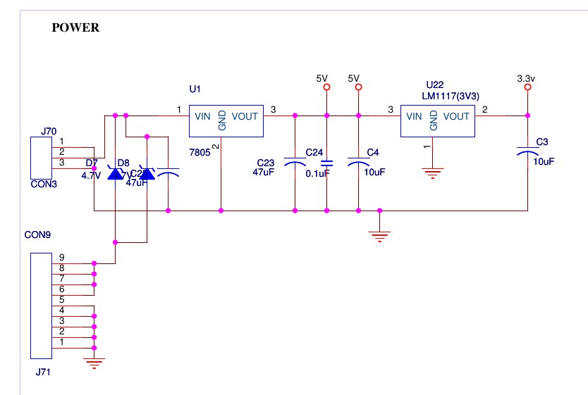

# Power and backup
* Connector _J70_ is the input power. 7.5v-12v input can be provided, best is to use 7.5v. The plan was to use a DC adapter with inbuilt battery circuit. Only a battery needs to be provided.
* Connector _CON9_ is for the printer power. The diagram is wrong, diodes d7, d8 are not used and can be replaced with a short.

## References
1. Product data sheets of 7805 & LM1117(3.3)

## Circuit

## Learnings
* 7805 is not a good choice, I choose this predominantly because almost all test boards from [NSK](http://www.nskelectronics.com) (at that time) had this cheap regulator. Didn't realize that this dissipates lot of heat and is not a good choice for battery based application.
