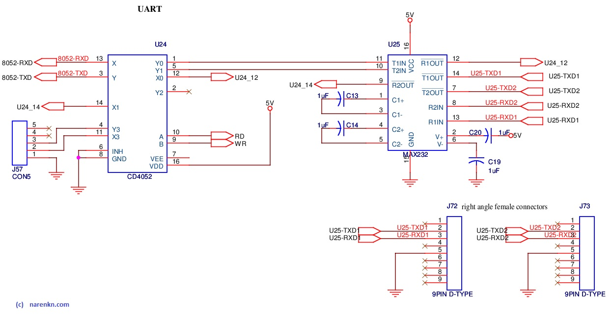

# Printer
The printer available in SP road, bangalore was similar to the CSN-A1 thermal printer spec attached here below. It can be interfaced through UART & TTL. I choose to use UART as AT32 already has UART module.

## References
1. [CSN A1 Thermal Printer](/resources/embedded/CSN-A1Printer.pdf)

## Circuit

## Driver
* Source files : [a1micro2mm.c](https://github.com/narenkn/atmega_biller/blob/atmega32/a1micro2mm.c), [a1micro2mm.h](https://github.com/narenkn/atmega_biller/blob/atmega32/a1micro2mm.h)  

Printing is equivalent to sending through UART. The reasoning behind coding printing routines as _macros_ is that we can later change any UART to be used for printer. Moreover we can even do a software UART instead of hardware UART.

## Board tests
* Files [test_bill.c](https://github.com/narenkn/atmega_biller/blob/atmega32/tests/test_bill.c)  
