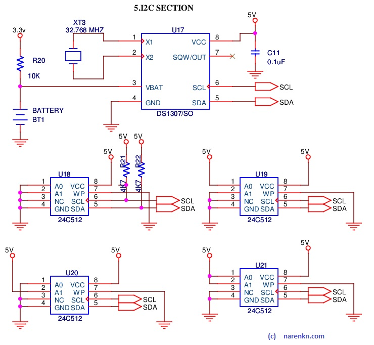

# I2C Storage
I2C based storage devices are very commonly available in the market. Products like _24C512_ can be bought about &#x20B9;50. A 512Kbit device contains 64Kbyte storage. I found that with effective packing, an item can be stored in less than 64 bytes. So, such devices can hold about 1,000 items. I2C devices have device addresses and support multiple devices on the same bus. Most of these devices support upto 4 devices connected to the same I2C bus.

I2C EEPROMs are exclusively used for storing items (product details).

## References
1. product datasheets are your best references here

## Circuit


## Driver
* Files [i2c.c](https://github.com/narenkn/atmega_biller/blob/atmega32/i2c.c) & [i2c.h](https://github.com/narenkn/atmega_biller/blob/atmega32/i2c.h) <br>

The main API is of 2 routines. In total we need an addressing space of `4*64Kbytes = 256Kbytes`, which needs 18 address bits. But you can notice the address in the API is only 16-bits. In this design lower two-bits is not stored, so the addressible granularity is 4-bytes. This should be OK as our items need about 64-bytes. The macro `EEPROM_MAX_DEVICES_LOGN2` is used to shift address appropriately.
```c
uint16_t ee24xx_read_bytes(uint16_t eeaddr, uint8_t *buf, uint16_t len);
uint16_t ee24xx_write_bytes(uint16_t eeaddr, uint8_t *buf, uint16_t len);
```

## Unit tests
* Files [test_i2c.c](https://github.com/narenkn/atmega_biller/blob/atmega32/units/test_i2c.c) & * [test_sditems.c](https://github.com/narenkn/atmega_biller/blob/atmega32/units/test_sditems.c). <br>

In unit tests we model the I2C behaviour in [i2c.c](https://github.com/narenkn/atmega_biller/blob/atmega32/tests/i2c.c). With this model, we then try to test other routines that depend on these.

## Board tests
* [test_i2c.c](https://github.com/narenkn/atmega_biller/blob/atmega32/tests/test_eeprom.c)<br>
