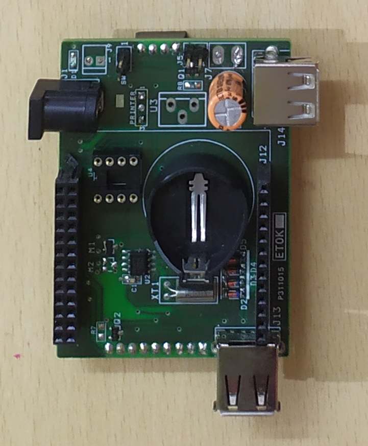
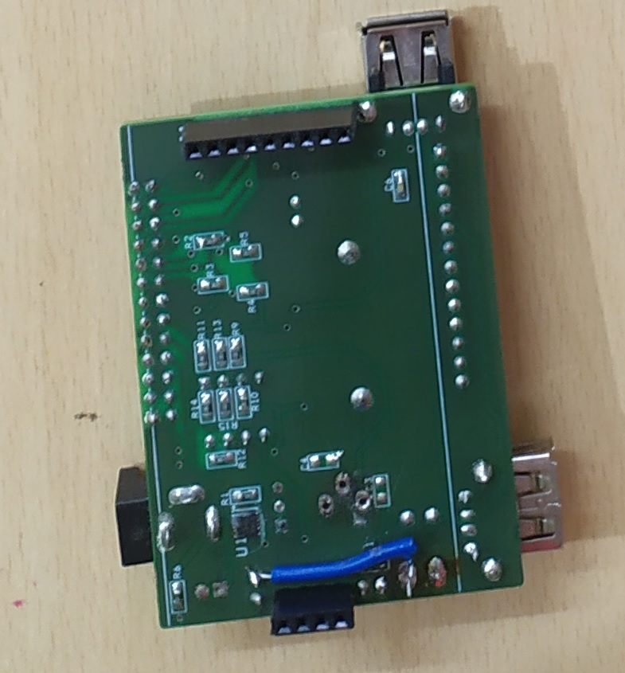

# Experiments with Orange PI
There are python drivers available. Usually, I like to create solutions in C++... so, I've the C drivers coded for the same. My experiments on OrangePI was to create solutions for the following
## As a webserver
For this solution, the backend server was fully wiritten in C++. The application is restaurant order management system. Successfully implemented.
## A webclient with a printer
The reasoning here was that we're in a phase of IoT transformation and I suppose it would enable every data storage to be on the internet. For big commercial shops, this transformation has already come. So, for every shop in the future the billing would be done online, enabled by any devices such as a mobile phone. But receipt needs to be printed and given to customer. This solution enables that. I've used OrangePI with thermal printer for this purpose. My solution was tested successfully about 2 years back. Will see if I can put a video on the same anytime.

## Boards
  
  

## Source
[My OPIZ GitHub](https://github.com/narenkn/opizd)

## References
* [Orange PI](http://www.orangepi.org/)

## UART
C Driver for UART interface : [uart.c](https://github.com/narenkn/opizd/blob/master/uart.c)

## SPI
C Driver for SPI interface : [spi_lib.c](https://github.com/narenkn/opizd/blob/master/spi_lib.c)

## I2C
C Driver for I2C interface : [spi_lib.c](https://github.com/narenkn/opizd/blob/master/spi_lib.c)

## GPIO
C Driver to drive any IO port directly : [gpio_lib.c](https://github.com/narenkn/opizd/blob/master/gpio_lib.c). A small test is [gpio.c](https://github.com/narenkn/opizd/blob/master/gpio.c).

## NOR Flash Driver
C Sources for NOR Flash [driver](https://github.com/narenkn/opizd/blob/master/W25Q64.c).

<Vssue title="Experiments with Orange PI" />
